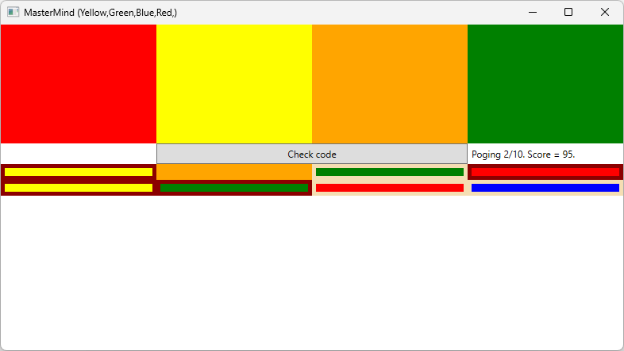
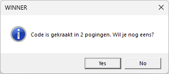
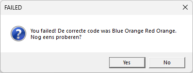
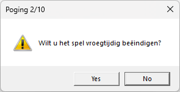

# Uitbreiding Mastermind

De eerste versie van het spel is gevalideerd door de spelcommissie en we hebben een GO gekregen om dit verder te ontwikkelen.

**Spelverloop:**

Momenteel is het niet mogelijk om het spel echt te spelen, want er is telkens maar 1 poging mogelijk. Dit gaan we uitbreiden zodat de speler maximaal 10 pogingen heeft om de code te raden. Na 10 pogingen stopt het spel automatisch en wordt de code getoond. Elke poging wordt ook bijgehouden in een lijst, zodat de speler uit zijn "foute" gokken kan leren.

Na elke poging wordt er ook een score bijgehouden. Hoewel we in de basisversie al punten hadden voorzien, hebben we hier verder nog niets mee gedaan. Maar de spelcommissie heeft hierover verder nagedacht en wil volgende wijziging implementeren:
Er zijn 100 punten te verdienen. Telkens wanneer de speler een poging doet, worden strafpunten afgetrokken. Wanneer men de code dus van de eerste keer juist raadt, krijgt men 0 strafpunten en wordt de maximale score van 100 punten gehaald.
-   De kleur op deze positie is correct: rood (0 strafpunten)
-   De kleur komt voor in de code, maar staat niet op de juiste plaats: wit (1 strafpunt)
-   Foute kleur: geen indicatie (2 strafpunten)

Zorg ervoor dat de speler zijn score kan zien in een label.

Na elke poging worden dus volgende stappen uitgevoerd:
- De speler krijgt feedback van zijn/haar poging (witte en rode kaders)
- Deze feedback wordt getoond in een lijst (historiek), zodat alle voorgaande pogingen zichtbaar blijven
- De score wordt herberekend
- De invoervelden worden terug leeggemaakt
- Het spel stopt na 10 pogingen OF wanneer de code is gekraakt

Na het einde van het spel wordt gevraagd of men nog eens wil spelen. 
Zo ja, wordt een nieuwe code gegenereerd en wordt het spel terug in zijn begintoestand gezet (historiek leegmaken, score op nul zetten, e.d.).
Zo nee, wordt de applicatie gesloten.

Wanneer men de applicatie wil sluiten voordat de code is gevonden, wordt dit gemeld en wordt de vraag gesteld of men wil doorgaan met het beëindigen van de applicatie.
Zo ja, wordt de applicatie gesloten.
Zo nee, gebeurd er niets en kan de speler gewoon verder spelen.

Als laatste wenst de spelcommissie dit spel al te commercialiseren. Hiervoor moet de layout echter aangepakt worden. Het goede nieuws is dat we hiervoor carte blanche hebben volledig zelf mogen kiezen hoe we het spel mooi kunnen maken.

### Functionele vereisten

| ID | Onderwerp | Beschrijving |
| :--- | :--- | :--- |
| Mastermind-06 | Pogingen | Zorg ervoor dat de speler 10 pogingen kan doen om de code te kraken. |
| Mastermind-07 | Historiek | Na elke poging wordt de ingegeven code met feedback (rood/wit) toegevoegd aan een lijst. Op deze manier kan de speler zijn voorgaande pogingen bekijken. |
| Mastermind-08 | Score | Na elke poging wordt de score herberekend en getoond in een label. 0 strafpunten = de kleur op deze positie is correct. 1 strafpunt = de kleur komt voor in de code, maar staat niet op de juiste plaats. 2 strafpunten = kleur komt niet voor in de code. |
| Mastermind-09 | Speleinde | Het spel eindigt na 10 pogingen OF wanneer de code gekraakt is. Toon een melding hiervan (i.g.v. 10de poging toon je de code) en stel de vraag of men nog eens wil spelen. Zo ja, wordt een nieuwe code gegenereerd en wordt het spel terug in zijn begintoestand gezet (historiek leegmaken, score op nul zetten, e.d.). Zo nee, wordt de applicatie gesloten. |
| Mastermind-10 | Afsluiten | Het spel mag in principe niet vroegtijdig afgesloten worden. Wanneer dit wel doet, wordt dit gemeld en wordt de vraag gesteld of men wil doorgaan met het beëindigen van de applicatie. Zo ja, wordt de applicatie gesloten. Zo nee, gebeurd er niets en kan de speler gewoon verder spelen. |
| Mastermind-11 | Layout | Maak zelf een mooie layout voor de gameplay. |

## Aanpak en tips

### Stappenplan

-   Analyseer grondig wat er geprogrammeerd moet worden en hoe je dat gaat doen.
-   Probeer te achterhalen wat het moeilijkste deel van de oefening is (vb. Hoe 10 pogingen voorzien? Hoe de score berekenen?) en onderzoek hoe je dit kan oplossen.
-   Programmeer het spel in Visual Studio.
-   Test het spel om te zien of het in alle omstandigheden werkt.
-   Zorg ervoor dat je code mooi gestructureerd is (vb. gebruik zinvolle namen voor variabelen).

### Programmeertips

-   Maak een method aan die je ingegeven kleurcode controleert.
-   Maak een method aan die de score berekend per poging (kan dit misschien in de method die de kleurcode controleert?)
-   Gebruik een private class-variabele om de code te bewaren.
-   Gebruik MessageBox om de meldingen te tonen.
-	Voor de layout kan je misschien Labels maken i.p.v. ComboBoxen? Bij elk MouseDown event wordt de volgende kleur als BackGround gezet (van de 6 beschikbare kleuren) en cycle je door alle kleuren.
